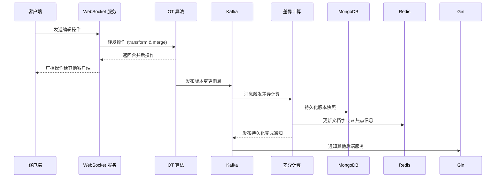
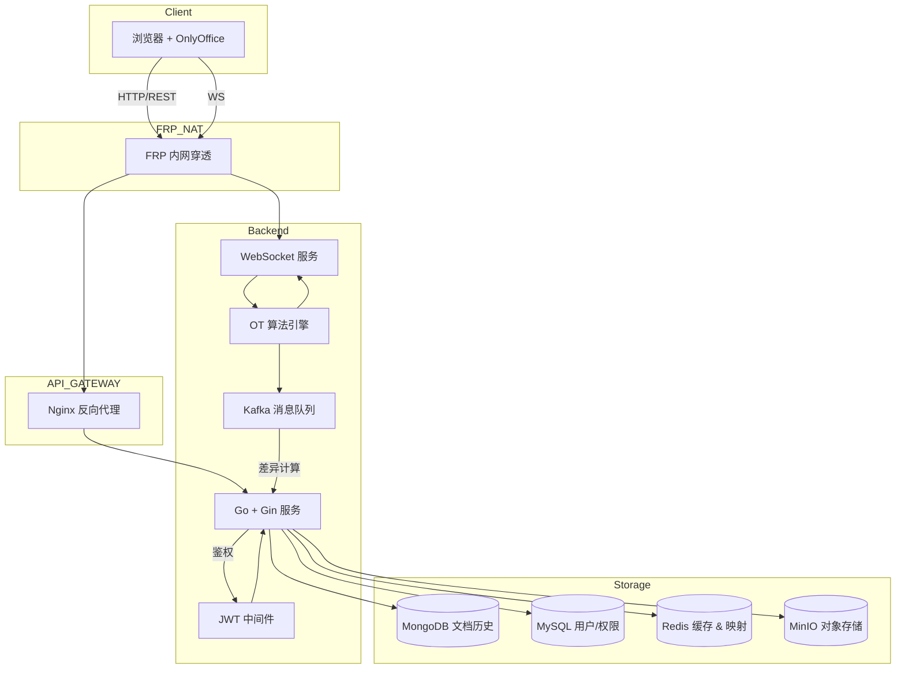

# CollabDoc-go

> **CollabDoc-go** 是一个开源的多人文档协作平台，支持 `.docx` 与 Markdown 文件的在线实时编辑、版本管理与冲突自动合并。

------

## 📌 项目简介

CollabDoc-go 致力于提供一个轻量、高性能的文档协作解决方案，帮助团队在线编辑、共享、回滚与比对文档版本。项目依托 Go 语言打造后端核心服务，结合 OnlyOffice 编辑器，实现端到端的实时协作体验。

## 🚀 核心功能

- **多人实时编辑**：基于 OT 算法自动合并冲突，WebSocket 实现低延迟、高并发的编辑同步。
- **版本管理与回滚**：Kafka 异步处理版本差异，MongoDB 持久化版本快照，支持一键回滚。
- **文档格式兼容**：同时支持 `.docx` 与 Markdown 格式，方便不同场景下的编辑需求。
- **细粒度权限控制**：JWT 双令牌鉴权（Access/Refresh），Token 内预置用户权限与元数据。
- **热点缓存与映射**：Redis 缓存前端动态路由、热点文档信息，并维护 docID ⇄ docUUID 映射。
- **分布式对象存储**：采用 MinIO 存储文档文件，支持横向扩展。
- **内网穿透 & 容器化部署**：FRP 实现远程访问，Docker 支持一键部署与弹性扩容。

## 🏗 技术栈

| 模块        | 技术/工具          |
| ----------- | ------------------ |
| 后端框架    | Go, Gin            |
| 文档编辑    | OnlyOffice SDK     |
| 实时通信    | WebSocket, OT 算法 |
| 异步 & 消息 | Kafka              |
| 数据存储    | MongoDB, MySQL     |
| 缓存 & 映射 | Redis              |
| 对象存储    | MinIO              |
| 鉴权        | JWT (双令牌机制)   |
| 部署        | Docker, FRP, Nginx |

## 📥 快速开始

1. **克隆仓库**

   ```bash
   git clone https://github.com/Demonx24/CollabDoc-go.git
   cd CollabDoc-go
   ```

2. **修改配置**

   - 在 `config/` 目录下，复制 `example.env` 为 `.env` 并根据环境调整：

     ```ini
     # 数据库
     MYSQL_DSN=...
     MONGO_URI=...
     
     # Redis
     REDIS_ADDR=...
     
     # Kafka
     KAFKA_BROKERS=...
     
     # MinIO
     MINIO_ENDPOINT=...
     MINIO_ACCESS_KEY=...
     MINIO_SECRET_KEY=...
     
     # JWT
     JWT_ACCESS_SECRET=...
     JWT_REFRESH_SECRET=...
     ```

3. **一键启动**（需安装 Docker & Docker Compose）

   ```bash
   docker-compose up -d
   ```

4. **访问**

   -  `http://localhost:8080`

5. **体验多人协作**

   - 打开两个不同浏览器窗口/标签页，登录同一文档，即可实时编辑并观察同步效果。

## 🔧 代码结构

```
├─ api                 # 接口定义与文档
├─ config              # 全局配置，如 ENV、常量等
├─ core                # 核心组件初始化与公共模块
├─ docker              # Dockerfile 与 docker-compose 配置
├─ documents           # 存储文档版本目录
│  └─ <docUUID>/        # 每个文档对应的 UUID 文件夹
│     ├─ doc_1         # 历史版本文件
│     ├─ doc_4
│     ├─ doc_5
│     ├─ doc_6
│     ├─ doc_7
│     └─ doc_8
├─ file                # 临时文件与上传下载处理
├─ global              # 全局变量与单例对象
├─ initialize          # 服务启动初始化逻辑（数据库、消息队列等）
├─ log                 # 日志初始化与日志滚转配置
├─ middleware          # 全局中间件（JWT、CORS、RateLimit 等）
├─ model               # 业务模型定义
│  ├─ appTypes         # 应用自定义类型
│  ├─ database         # ORM 实体与数据库表映射
│  ├─ request          # API 请求参数结构体
│  └─ response         # API 响应格式结构体
├─ ot                  # OT 算法实现与操作合并逻辑
├─ router              # 路由注册及权限分配
├─ saved               # 文档暂存或草稿管理
├─ service             # 业务服务层，实现核心功能逻辑
├─ static              # 静态资源（HTML、CSS、JS）
├─ templates           # 前端模板文件（OnlyOffice 集成模板）
├─ utils               # 工具函数库，如日期、加密、UUID 生成
├─ websocket           # WebSocket 服务入口与连接管理
└─ ws                  # WebSocket 消息处理及广播逻辑
```

每个目录职责说明：

- **api**：定义 RESTful 接口的路由文档与示例。
- **config**：存放环境变量、配置结构体与加载逻辑。
- **core**：应用核心初始化，例如全局日志、配置加载、对象工厂。
- **docker**：项目容器化相关文件，便于一键部署。
- **documents**：按文档 UUID 存放历史版本文件，支持版本回滚与比对。//已经被minio代替
- **file**：处理上传、下载与文件缓存的公共逻辑。
- **global**：定义全局变量与单例，如数据库连接、Kafka 生产者等。
- **initialize**：在项目启动时执行依赖注入与服务注册。
- **log**：配置日志框架（如 Zap），管理日志级别与输出。
- **middleware**：封装 JWT 鉴权、CORS、限流等中间件。
- **model**：组织领域模型与数据结构，用于请求/响应和 ORM 映射。
- **ot**：实现 OT 算法核心逻辑，处理操作转换与冲突合并。
- **router**：统一注册所有 HTTP 路由与权限校验规则。
- **saved**：管理文档草稿或临时编辑内容的存储。
- **service**：封装业务逻辑，与数据库、缓存与消息队列交互。
- **static**：存放静态资源文件，用于前端展示或下载。
- **templates**：OnlyOffice 编辑器的文档模板与视图。
- **utils**：提供通用工具函数，减少代码重复。
- **websocket**：初始化 WebSocket 服务和连接管理。
- **ws**：处理接收到的 WebSocket 消息并广播更新给客户端。

## 📈 架构图





## 📝 贡献指南

1. Fork 本仓库
2. 创建新分支：`git checkout -b feature/your-feature`
3. 提交代码并推送：`git push origin feature/your-feature`
4. 开 PR 并描述功能或 Bug 修复
5. CI 通过后等待合并。

## 📄 许可证

本项目采用 MIT 许可证，详见 [LICENSE](https://chatgpt.com/c/LICENSE)。

------

感谢你的关注和使用！如有问题，欢迎提交 Issues 或者联系作者。
